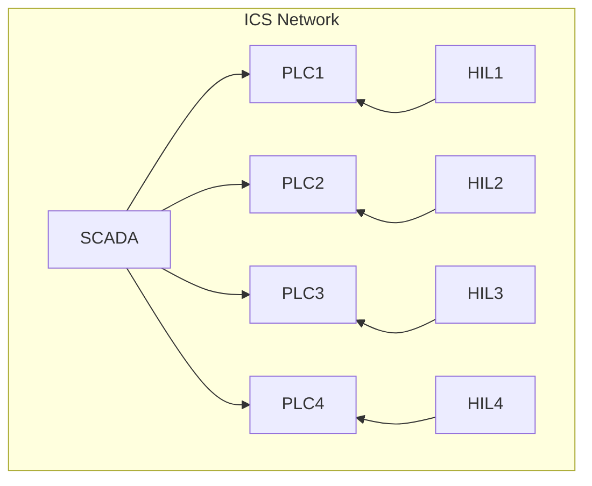

# Fully Virtualized – Insecure Environment

This configuration represents a fully virtualized Industrial Control System (ICS) network without security mechanisms.
All components are deployed as Docker containers connected through a Docker network.

## Architecture

### HIL (Hardware-in-the-Loop)

**Python** script that simulates a robotic arm as a **Modbus TCP** client, which executes commands read from the PLC.

### PLC (Programmable Logic Controller)

**OpenPLC** instance, including a **Modbus TCP** server (**OpenPLC runtime**) and a web interface for configuration and monitoring.

The web interfaces can be accessed at the following URLs:

- PLC1: http://localhost:8081
- PLC2: http://localhost:8082
- PLC3: http://localhost:8083
- PLC4: http://localhost:8084

### SCADA (Supervisory Control and Data Acquisition)

**ScadaBR** web interface that monitors all PLC variables in real-time.

The web interface can be accessed at:

- http://localhost:8080/ScadaBR

## Network Architecture



## Running the Environment

### Prerequisites

* Docker
* Docker Compose

### Configuration

To run this configuration, switch to the appropriate branch:
```bash
git checkout unsafe-env
```

Set up the .env file:
```bash
mv .env.example .env
```
- `OPENPLC_ADMIN` – **OpenPLC** webserver admin username
- `OPENPLC_PASSWORD` – **OpenPLC** webserver admin password

### Execution
    
Start the containers:
```bash
docker compose up -d
```

To stop the environment:
```bash
docker compose down
```

## Logs

If everything is working correctly, each **HIL** container should log the simulated robotic arm actions.

Show all network logs:
```bash
docker compose logs -f
```

Show specific container logs:
```bash
docker compose logs -f <container_name>
```